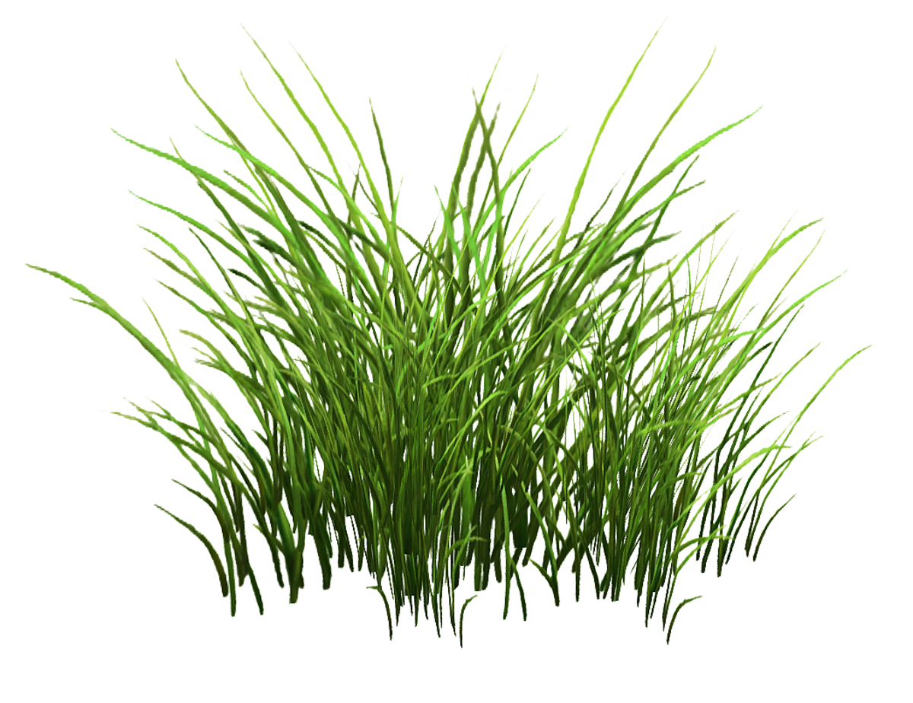

I relaunched my website, now fully custom-written using React, Gatsby, and GraphQL.

Here's a picture:




I can also use code blocks that support syntax highlighting, thanks PrismJS!

```javascript
//with js lang tag

var s = "JavaScript syntax highlighting";
alert(s);
```

I can highlight inline text too, like this C++ example: ` cpp> std::cout << "Hi!" << std::endl; `. Isn't that neat?