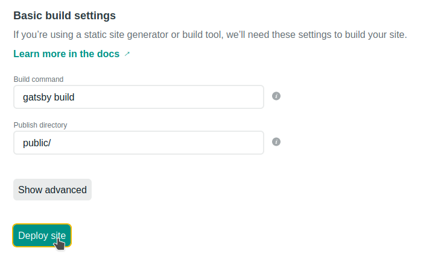

### The Gatsby Experience

I'll keep things short, sweet: Gatsby is great. If you haven't heard of Gatsby, it's a static site generator built on top of ReactJS. It allows developers to build sites that leverage nearly all of the features of the clean and modern React framework, while providing users with an incredibly fast experience. Content like images can also be optimized at build time, so bandwidth costs are reduced. Since you're building a static site, there's also no need to keep a Node backend running, so hosting is a trivial issue.

Designing this website was just like the prototypical React experience; pages and their constituent components are written in JSX, and you can easily use a CSS-in-JS library like **styled-components** or **Emotion** for reusable React-friendly styling. But, where Gatsby really shines is in its content-generating APIs. Gatsby leverages the GraphQL language to intuitively source data for populating your website. I used GraphQL to read the Markdown files populating my blog posts (including this one!), but you could also use one of Gatsby's many plugins to use GraphQL to source from any popular content management system like WordPress or Contentful.

Now, this doesn't sound particularly exciting until you realize that everything is done at build time. This means that GraphQL can query WordPress for all your content just *once*, and then process each item to fit to a specific template. Gatsby's build-time preprocessing can optimize your content to improve load times; for example, mobile users viewing your website can quickly load optimized images with a smaller resolution than those on desktops. It also supports progressive and lazy loading to only deliver the content you need, and keep an aesthetic placeholder until it loads - even if it'll be near-instant. This is similar to *Medium.com*'s blurred placeholder images, but without them taking several seconds to load. Gatsby's static build model and supporting packages ensure that you'll spend less time worrying about efficiently delivering your content to your audience, and more time producing the content itself.

### Building This Site

Getting Gatsby up and running is - *in my opinion* - the most painless way to get a personal website online. CDN and CI/CD services like Heroku, Netlify, Azure *etc.* can build and deploy a finalized version of your website directly from your source code hosted on GitHub. The steps I took to get *prost.ca* online were:

1. Install the Gatsby command line interface via Node: `npm install -g gatsby-cli`
2. Clone the Gatsby starter boilerplate into a new repository: 
```gatsby new prost.ca https://github.com/gatsbyjs/gatsby-starter-default```
3. Design and build the site itself. This is obviously going to be the most time-consuming part of the process, as it's contingent on the site's requirements. Gatsby offers many [plugins and libraries](https://www.gatsbyjs.com/plugins) that can extend GraphQL's functionality, preprocess your content, enable CSS libraries, and more. The [Gatsby showcase](https://www.gatsbyjs.com/showcase/) also includes many open-source projects that you can check out for inspiration, or to see how something was implemented.
4. Push the finished (or WIP) site repository to GitHub.
5. Register an account with [Netlify](https://app.netlify.com/signup) and connect it to my GitHub account from step #4.
6. Create a new site from the [Netlify prompt](https://app.netlify.com/start) by selecting GitHub as the source provider, and then choosing my website repository:

7. Check the Netlify build commands to make sure they match those in the `package.json` file, then hit *Deploy*! Netlify will then spend a few moments running the build scripts and preprocess any content - this can take longer for a site with many images or is sourcing lots of content from an external CMS.


And voilà! Netlify has deployed my (or your) full site on a custom subdomain like `https://[custom name].netlify.app/`. Netlify hosts the site on their CDN, and automatically provides SSL encryption. If you have a custom domain name, you can also point your domain's nameservers to those provided by Netlify. And the best part about this? It's **free.**

Having previously deployed several Wordpress websites on AWS (including a previous iteration of my personal website), the process could get quite convoluted. SSL and CDN support needed to be manually configured, and running the WordPress server itself would cost money.

### Summary

If you want to build a predominantly static website like a blog or portfolio, Gatsby and Netlify is as easy and as low-cost as it gets. You can leverage the flexibility of React and its libraries for designing your frontend, without needing to worry unnecessarily about the backend and hosting. As only static content is being delivered, SEO is a breeze, and there are fewer security concerns to worry about. Gatsby's active community and large selection of plugins makes development simple, and finished sites will be incredibly snappy versus the single-page application status-quo. Simply put, Gatsby is a breath of fresh air.

*Header photo by Christina Morillo from Pexels*